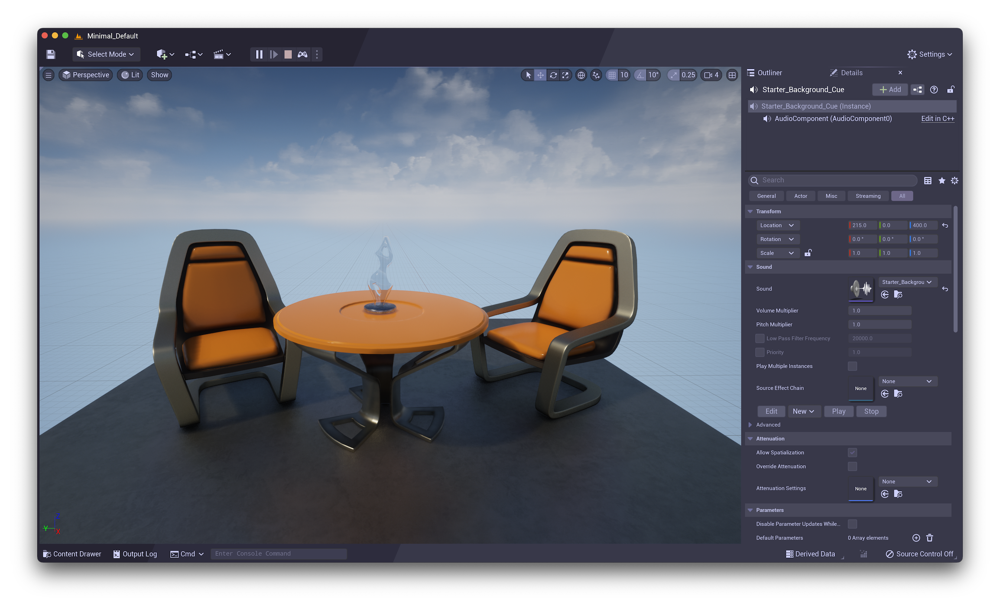
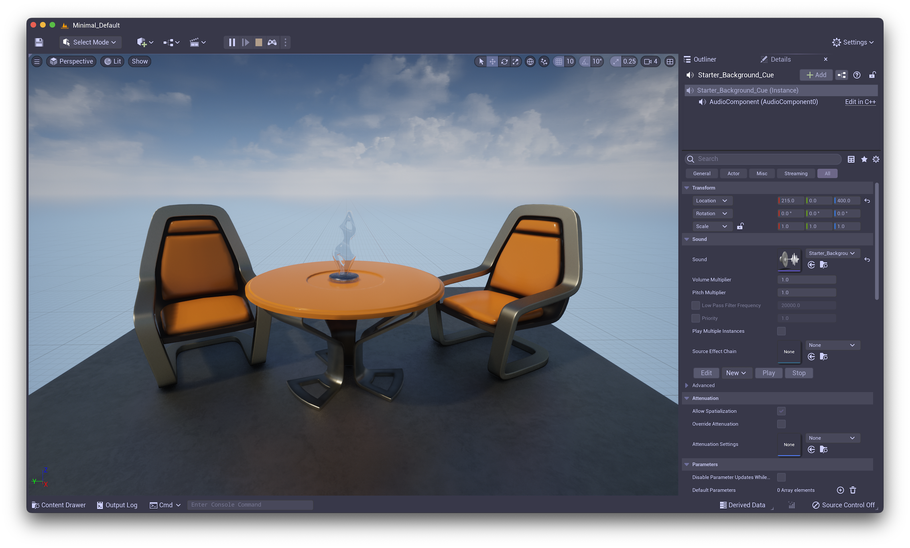
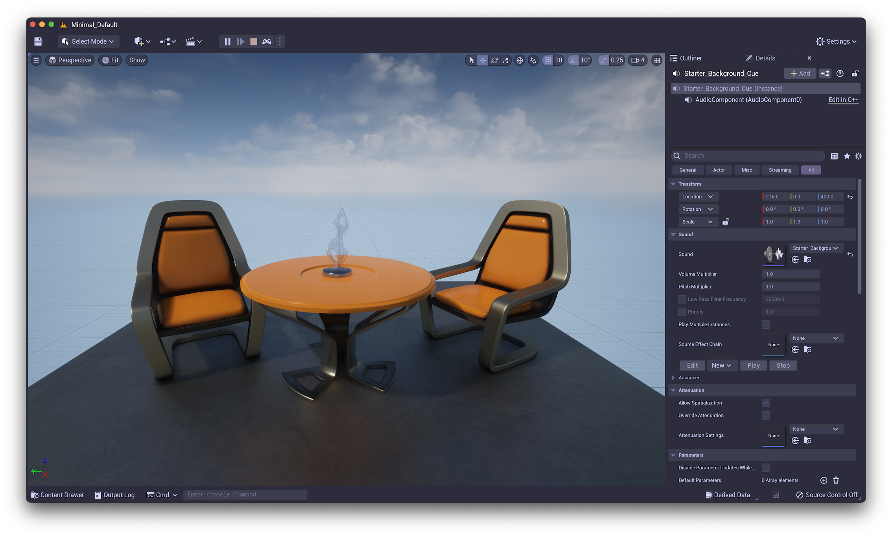

<h3 align="center">
	 
	
	Catppuccin for <a href="https://www.unrealengine.com/">Unreal Engine</a>
	
</h3>

	
	
	

	

## Previews

🪴 Frappé

🌺 Macchiato

🌿 Mocha

## Usage

1. Go to your `/Engine/Content/Slate` directory
2. Create a `Themes` directory
3. Drop all 4 json from the `dist` folder in `Themes`.
4. In Unreal Engine, in Preferences > Colors, select your favorite "Active Theme".

## 🙋 FAQ

-	Q: **_"What about the Latte theme?"_**\
	A: Unfortunately, Unreal Engine doesn't look very good with light themes. You can however find the generated Latte theme in the dist folder, but we do not recommend to use it.

## 💝 Thanks to

- [Quentin](https://github.com/quentinguidee)

&nbsp;

	

	Copyright &copy; 2021-present <a href="https://github.com/catppuccin" target="_blank">Catppuccin Org</a>

	

